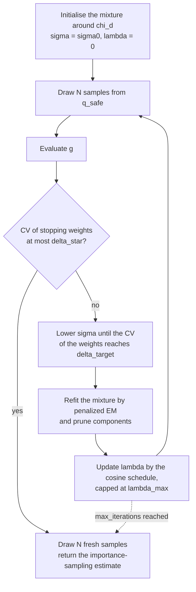

# Theory

This page describes the method as it is implemented in this package, including
the places where the implementation departs from the paper on purpose.
Equation numbers refer to Gao and Karniadakis (2025).

## The problem

Let \(\mathbf{U} \sim \mathcal{N}(\mathbf{0}, \mathbf{I}_d)\) and let
\(g : \mathbb{R}^d \to \mathbb{R}\) be a limit-state function. The failure
probability is

\[
P_F = \mathbb{P}\bigl(g(\mathbf{U}) \le 0\bigr)
    = \int_{\mathbb{R}^d} \mathbb{1}\{g(\mathbf{u}) \le 0\}\, \varphi_d(\mathbf{u})\, d\mathbf{u},
\]

where \(\varphi_d\) is the standard normal density. Crude Monte Carlo estimates
it by the fraction of failed samples, with coefficient of variation

\[
\delta = \sqrt{\frac{1 - P_F}{N P_F}},
\]

so reaching \(\delta\) takes about \(N \approx 1/(P_F\,\delta^2)\) samples:
\(10^8\) for \(P_F = 10^{-6}\) at 10%. When each evaluation of \(g\) is a
simulation, that is out of reach.

## Importance sampling

Drawing from a proposal density \(q\) instead, and reweighting,

\[
P_F = \mathbb{E}_q\!\left[\mathbb{1}\{g(\mathbf{U}) \le 0\}\,
      \frac{\varphi_d(\mathbf{U})}{q(\mathbf{U})}\right],
\qquad
\hat P_F = \frac{1}{N} \sum_{i=1}^{N} \mathbb{1}\{g(\mathbf{u}_i) \le 0\}\,
           \frac{\varphi_d(\mathbf{u}_i)}{q(\mathbf{u}_i)},
\quad \mathbf{u}_i \sim q .
\]

The estimator is unbiased for any \(q\) that is positive on the failure region.
Its variance vanishes for \(q^*(\mathbf{u}) = \mathbb{1}\{g(\mathbf{u}) \le 0\}\,
\varphi_d(\mathbf{u}) / P_F\), which cannot be used directly because it
contains the unknown \(P_F\). The cross-entropy approach fits a parametric
family to it instead.

Two things can go wrong. If \(q\) misses part of the failure region, the
estimate is short by that part's share, with nothing in the samples to show it.
If \(q\) has lighter tails than \(\varphi_d\) somewhere, the weights
\(\varphi_d/q\) are unbounded there and a single sample can dominate the
estimate. Safe-ICE is designed around both.

## Improved cross-entropy

Fitting \(q^*\) directly fails when \(P_F\) is small, because almost no samples
fail. Improved cross-entropy (ICE) approaches it through a sequence of easier,
smoothed problems. The indicator is replaced by

\[
h(\mathbf{u}; \sigma) = \Phi\!\left(-\frac{g(\mathbf{u})}{\sigma}\right),
\]

which tends to \(\mathbb{1}\{g(\mathbf{u}) \le 0\}\) as \(\sigma \to 0\) and is
positive everywhere for \(\sigma > 0\), so every sample carries some
information.

At iteration \(t\), with samples \(\mathbf{u}_i\) from the current proposal
\(q_t\), the intermediate weights are

\[
W_t(\mathbf{u}; \sigma) = \Phi\!\left(-\frac{g(\mathbf{u})}{\sigma}\right)
                          \frac{\varphi_d(\mathbf{u})}{q_t(\mathbf{u})}.
\]

**Choosing the next \(\sigma\).** Equation 10 picks the \(\sigma\) whose weights
have a coefficient of variation closest to a target \(\delta_{\text{target}}\):

\[
\sigma_{t+1} = \operatorname*{arg\,min}_{\sigma \in (0,\, \sigma_t)}
  \Bigl(\operatorname{CV}\bigl(W_t(\cdot\,; \sigma)\bigr) - \delta_{\text{target}}\Bigr)^2 .
\]

The CV rises as \(\sigma\) falls, because a sharper indicator concentrates the
weight on fewer samples. The implementation therefore scans down from
\(\sigma_t\) on a geometric grid until the CV first reaches the target, then
bisects. If the CV is already past the target at \(\sigma_t\), \(\sigma\) is
held and the refit is left to improve the proposal first.

**Stopping.** The stopping weights compare the true indicator with the smoothed
one:

\[
W^*_t(\mathbf{u}) = \frac{\mathbb{1}\{g(\mathbf{u}) \le 0\}}
                         {\Phi\bigl(-g(\mathbf{u})/\sigma_t\bigr)} .
\]

The run stops when \(\operatorname{CV}(W^*_t) \le \delta^*\) (`delta_star`),
that is, when the smoothed problem is close enough to the real one.

**Refitting.** Otherwise the proposal parameters are refitted to the weighted
samples by maximising \(\sum_i W_t(\mathbf{u}_i; \sigma_{t+1}) \ln
q(\mathbf{u}_i; \theta)\). This is the cross-entropy step, carried
out by [penalized EM](#penalized-em).

## The proposal

### The vMF-Nakagami mixture

Each point is split into a radius and a direction, \(\mathbf{u} = r\mathbf{a}\)
with \(r = \lVert\mathbf{u}\rVert\) and \(\mathbf{a} \in \mathbb{S}^{d-1}\). The
light-tailed part of the proposal is a mixture of \(K\) components, each a
Nakagami distribution on the radius and a von Mises-Fisher distribution on the
direction:

\[
q_{\text{vMFNM}}(\mathbf{u}) = \sum_{k=1}^{K} \pi_k\,
  \frac{f_{\mathrm{N}}(r; m_k, \Omega_k)\, f_{\mathrm{vMF}}(\mathbf{a}; \mu_k, \kappa_k)}{r^{d-1}},
\]

where the division by \(r^{d-1}\) is the Jacobian of the polar map, which makes
this a density on \(\mathbb{R}^d\). The two factors are

\[
f_{\mathrm{N}}(r; m, \Omega) = \frac{2 m^m}{\Gamma(m)\,\Omega^m}\, r^{2m-1}
  \exp\!\left(-\frac{m r^2}{\Omega}\right),
\qquad
f_{\mathrm{vMF}}(\mathbf{a}; \mu, \kappa) = C_d(\kappa)
  \exp\!\left(\kappa\, \mu^{\top} \mathbf{a}\right),
\]

with \(C_d(\kappa) = \kappa^{d/2-1} / \bigl((2\pi)^{d/2} I_{d/2-1}(\kappa)\bigr)\).

This family suits the problem. The radius of a standard normal vector in
\(\mathbb{R}^d\) follows \(\chi_d\), which is exactly
\(\text{Nakagami}(m = d/2, \Omega = d)\), and in high dimensions the mass sits
on a thin shell of radius about \(\sqrt{d}\). A Gaussian mixture would have to
approximate that shell with ellipsoids; a radius-direction split represents it
directly. The mixture is initialised around the prior accordingly: equal
weights, \(m_k\) and \(\Omega_k\) at \(d/2\) and \(d\) times a random factor in
\([0.75, 1.5]\), random directions, and small concentrations.

### The safe mixture

The proposal actually sampled adds a heavy-tailed component:

\[
q_{\text{safe}}(\mathbf{u}) = \lambda\, q_{\text{vMFNM}}(\mathbf{u}) +
                            (1 - \lambda)\, q_{\text{heavy}}(\mathbf{u}).
\]

\(q_{\text{heavy}}\) shares the weights and directions of the mixture but draws
the radius from an inverse Nakagami distribution, the law of \(1/R\) for
\(R \sim \text{Nakagami}(m, \Omega)\):

\[
f_{\mathrm{IN}}(r; m, \Omega) = \frac{2 m^m}{\Gamma(m)\,\Omega^m}\, r^{-2m-1}
  \exp\!\left(-\frac{m}{\Omega r^2}\right).
\]

Its tail decays polynomially rather than like \(e^{-r^2}\), so it is heavier
than the target's and the weights \(\varphi_d / q_{\text{safe}}\) stay bounded.
Every component uses the shape \(m_{\mathrm{IN}} = \lceil\sqrt{d}\,\rceil\), and
its scale is chosen so that the mode of the inverse Nakagami sits at the mean
radius of the corresponding Nakagami component (equation 34):

\[
\Omega_{\mathrm{IN},k} = \frac{2 m_{\mathrm{IN}}}{2 m_{\mathrm{IN}} + 1}
  \left(\frac{\Gamma(m_k)}{\Gamma(m_k + \tfrac{1}{2})}\right)^{\!2}
  \frac{m_k}{\Omega_k}.
\]

### The annealing schedule

The share of the light-tailed mixture follows a cosine schedule in \(\sigma\)
(equation 35), with \(M = \sigma_0\):

\[
\lambda(\sigma) = \min\!\left(\tfrac{1}{2}\left(1 + \cos\frac{\pi\sigma}{M}\right),\;
                  \lambda_{\max}\right).
\]

At the start \(\sigma = \sigma_0\), so \(\lambda = 0\) and the first iteration
samples only the heavy-tailed component, which explores. As \(\sigma\) falls,
sampling shifts toward the fitted mixture. The cap
\(\lambda_{\max} = 0.95\) is this implementation's addition; see
[below](#where-this-implementation-departs-from-the-paper).

## Penalized EM

The mixture is refitted by expectation-maximisation on the weighted samples,
with a penalty that removes components the data do not support. The number of
components therefore adapts, starting from `K0 = 20`.

**E-step.** Responsibilities of component \(k\) for sample \(i\):

\[
\gamma_{ik} = \frac{\pi_k\, q_k(\mathbf{u}_i)}{\sum_{j} \pi_j\, q_j(\mathbf{u}_i)} .
\]

**Mixture weights.** The weighted EM update (equation 19) is followed by a
cross-entropy penalty (equation 21):

\[
\pi_k^{\mathrm{EM}} = \frac{\sum_i W_i\, \gamma_{ik}}{\sum_i W_i},
\qquad
\pi_k \leftarrow \pi_k^{\mathrm{EM}} +
  \beta\, \pi_k^{\mathrm{old}} \Bigl(\ln \pi_k^{\mathrm{old}} -
  \sum_{s} \pi_s^{\mathrm{old}} \ln \pi_s^{\mathrm{old}}\Bigr).
\]

The bracket is a component's surprisal relative to the average. It is zero when
the weights are uniform, and it moves weight from small components to large
ones while keeping the total at one. Components whose weight falls to zero or
below are removed and the rest renormalised (equation 22).

**Penalty strength.** \(\beta\) starts at 1 and is recomputed after each M-step
(equations 23 and 24):

\[
\beta = \max\!\left\{0,\; \min\!\left\{
  \frac{1}{K} \sum_{k} e^{-\eta N \lvert \pi_k^{\mathrm{new}} - \pi_k^{\mathrm{old}} \rvert},\;
  \frac{1 - \max_k \pi_k^{\mathrm{EM}}}{-\max_k \pi_k^{\mathrm{old}} \cdot E}
\right\}\right\},
\]

with \(\eta = \min\bigl(1, 0.5^{\lfloor d/2 \rfloor - 1}\bigr)\) and
\(E = \sum_k \pi_k^{\mathrm{old}} \ln \pi_k^{\mathrm{old}} < 0\). The first term
stays small while the weights are still moving, so the penalty does not prune
during the unsettled early iterations. The second caps \(\beta\) so that at
least one component survives.

**Component parameters.** With \(w_{ik} = W_i \gamma_{ik}\), the radial
parameters come from weighted moments,

\[
\Omega_k = \frac{\sum_i w_{ik} r_i^2}{\sum_i w_{ik}},
\qquad
m_k = \max\!\left(\frac{\Omega_k^2}{\overline{r^4}_k - \Omega_k^2},\; \tfrac{1}{2}\right),
\]

where \(\overline{r^4}_k\) is the weighted mean of \(r_i^4\). The directions come
from the weighted resultant: \(\mu_k\) is its direction, and
\(\kappa_k\) is estimated from its mean length \(\bar R_k\) as
\(\bar R_k (d - \bar R_k^2) / (1 - \bar R_k^2)\) (Banerjee et al., 2005), with
the standard circular approximations when \(d = 2\).

EM repeats for up to `em_max_iter` iterations, or until the weighted
log-likelihood changes by less than \(10^{-6}\).

## The final estimate

The iteration samples come from different proposals, and the early ones from
poor ones, so they are not reused. Once the loop ends, \(N\) fresh samples are
drawn from the final \(q_{\text{safe}}\) and

\[
\hat P_F = \frac{1}{N} \sum_{i=1}^{N} \mathbb{1}\{g(\mathbf{u}_i) \le 0\}\,
           \frac{\varphi_d(\mathbf{u}_i)}{q_{\text{safe}}(\mathbf{u}_i)}
\]

(equation 36) is returned, clamped to \([0, 1]\).

## The algorithm at a glance

## Where this implementation departs from the paper

Each of these was a measured problem with the literal reading, and each is
explained in the source where it is made.

**\(\lambda\) is capped at \(\lambda_{\max} = 0.95\).** Equation 35 reaches
exactly 1 as \(\sigma \to 0\), removing the heavy-tailed component that makes
the method safe. Without it the weights are unbounded again: on one seed a
single sample carried 99.5% of the estimate. The cap keeps a 5% heavy-tailed
share throughout.

**\(\sigma\) is bracketed from above rather than minimised globally.** Over most
of \((0, \sigma_t)\) on a rare-event problem, \(\Phi(-g/\sigma)\) underflows to
zero for every sample and the CV is undefined. Just above that region a handful
of surviving samples make the CV sweep through the target on its way to
infinity, which creates spurious minima at a \(\sigma\) hundreds of times too
small. Taking the first crossing from above avoids both.

**\(\sigma_0\) defaults to `"auto"`.** Only \(g/\sigma\) matters, and the paper's
\(\sigma_0 = 1\) assumes \(g\) is of order one. Because \(\sigma\) only ever
falls, starting too high costs an iteration while starting too low cannot be
undone, so [`SafeICE`][safe_ice.SafeICE] starts from
\(\max(1, \operatorname{std}(g))\) over a pilot sample.

**Densities are floored at the smallest positive float.** A fixed floor such as
\(10^{-15}\) is far above typical proposal densities once \(d\) reaches about
20, and flooring there drives the estimate toward zero.

## References

- Gao, Z. and Karniadakis, G. (2025). Safe cross-entropy-based importance
  sampling for rare event simulations.
  [arXiv:2509.07160](https://arxiv.org/abs/2509.07160).
- Papaioannou, I., Geyer, S. and Straub, D. (2019). Improved cross
  entropy-based importance sampling with a flexible mixture model. *Reliability
  Engineering & System Safety*, 191, 106564.
- Kurtz, N. and Song, J. (2013). Cross-entropy-based adaptive importance
  sampling using Gaussian mixture. *Structural Safety*, 42, 35–44.
- Au, S.-K. and Beck, J. L. (2001). Estimation of small failure probabilities in
  high dimensions by subset simulation. *Probabilistic Engineering Mechanics*,
  16(4), 263–277.
- Rubinstein, R. Y. and Kroese, D. P. (2004). *The Cross-Entropy Method.*
  Springer.
- Banerjee, A., Dhillon, I. S., Ghosh, J. and Sra, S. (2005). Clustering on the
  unit hypersphere using von Mises-Fisher distributions. *Journal of Machine
  Learning Research*, 6, 1345–1382.
